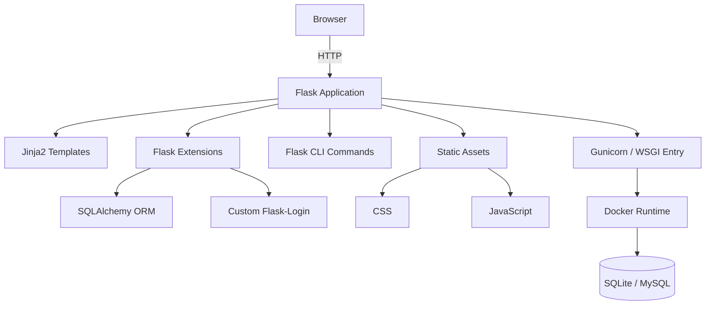

# School Library Management – 技术说明

## 概览
本项目采用 Flask 3 作为核心 Web 框架，结合 SQLAlchemy ORM、Jinja2 模板和自定义扩展组件，提供一套以服务端渲染为中心的管理后台技术实现。应用支持原生 SQLite，也可通过环境变量切换到 MySQL，部署层面提供 Docker 镜像和 docker-compose 编排，便于在不同环境间保持一致的运行方式。

## 技术栈与架构
- **运行时**：Python 3.11，Flask 应用通过 Gunicorn 暴露 WSGI 接口。
- **数据访问**：Flask-SQLAlchemy 提供 ORM 能力，模型统一继承时间戳与软删除混入类，确保结构化审计和可回滚删除。
- **身份与会话**：内置轻量级 Flask-Login 兼容实现，支持登录态持久化与权限钩子扩展。
- **模板与静态资源**：Jinja2 渲染 HTML，配合自定义 CSS 与 JavaScript 完成交互增强，保持响应式布局。
- **CLI 与扩展**：Flask CLI 命令封装数据库初始化、种子数据、迁移等操作；扩展注册集中于 `app/extensions.py`，对缺失依赖具备降级处理。
- **部署与运维**：Dockerfile 构建瘦身镜像，docker-compose 组合 Web 与数据库服务，默认暴露 5000 端口并通过环境变量注入配置。



## 目录结构
项目主要目录如下，侧重展示与技术相关的组成：
```
app/
  __init__.py      # 应用工厂、配置、蓝图注册、上下文注入
  extensions.py    # 延迟初始化数据库、迁移、登录等扩展
  models.py        # SQLAlchemy 模型与 mixin 实现
  utils/           # 通用工具，如分页、分类树、配置加载
  views/           # 功能蓝图，划分认证、统计等模块
  static/
    css/           # 样式资源
    js/            # 前端交互脚本
  templates/       # Jinja2 模板
flask_login/       # 内置 Flask-Login 简化实现
Dockerfile         # 构建生产镜像
docker-compose.yml # 本地与集成环境编排
requirements.txt   # Python 依赖清单
wsgi.py            # WSGI 入口
```

## 配置与环境变量
- `SECRET_KEY`：Flask 会话与表单 CSRF 加密密钥，部署时需显式设置。
- `DATABASE_URI`：SQLAlchemy 数据库连接字符串，支持 MySQL、SQLite 等后端。
- `FLASK_APP` / `FLASK_RUN_PORT`：本地 CLI 与调试服务器使用的入口与端口。
- 数据持久化可通过挂载 `instance/` 目录或连接外部数据库实现。

## 开发与运行
1. 建议使用 `python -m venv .venv && source .venv/bin/activate && pip install -r requirements.txt` 创建隔离环境并安装依赖。
2. 通过 `flask --app wsgi init-db` 初始化数据库，再执行 `flask --app wsgi seed` 准备默认数据。
3. 使用 `flask --app wsgi run --debug` 启动调试服务器；生产环境推荐 `gunicorn -w 4 -b 0.0.0.0:5000 wsgi:app`。
4. 采用 Docker 时可执行 `docker compose up -d --build`，并在容器内运行初始化脚本。

## 测试与质量保障
- 可结合 pytest、Flask 提供的测试客户端构建单元测试与集成测试。
- SQLAlchemy 会话可通过工厂函数与上下文管理器在测试中复用。
- 建议引入 `flake8`、`black` 等工具保持代码规范与格式统一。

## 二次开发建议
- 在新增扩展或模块时，统一在应用工厂中完成注册，保持配置集中化。
- 模型更新应配合 Flask-Migrate 生成迁移脚本，并在 CI/CD 中执行升级。
- 静态资源可根据需要集成前端构建工具，在 `app/static/` 下输出打包产物。

## 参考资料
本说明基于仓库中的 README.md、Dockerfile、docker-compose.yml、requirements.txt、wsgi.py、app/__init__.py、app/extensions.py、app/models.py、app/utils/、app/views/、app/static/、docs/data-dictionary.md 及 flask_login/ 目录内容编写。
